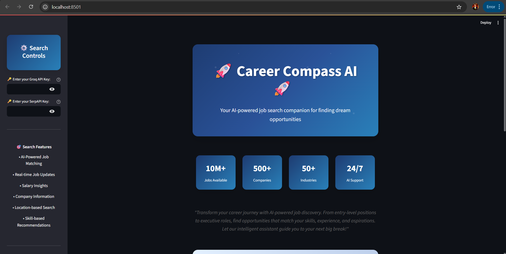

# 🚀 Career Compass AI 🚀

A revolutionary AI-powered job search application that helps users find their dream opportunities using Google Jobs API and intelligent matching algorithms.

## ✨ Features

### 🎯 **Intelligent Job Matching**
- AI-powered job recommendations based on skills and experience
- Real-time job search across multiple platforms
- Smart filtering and sorting capabilities
- Personalized job suggestions

### 🔍 **Advanced Search Capabilities**
- **Role-based Search**: Find specific job titles and positions
- **Location-based Search**: Search by city, state, or remote options
- **Salary-based Search**: Filter by minimum salary requirements
- **Experience Level**: Entry, Mid, Senior, or Executive positions
- **Job Type**: Full-time, Part-time, Contract, or Internship
- **Industry Focus**: Technology, Healthcare, Finance, etc.
- **Remote Options**: Remote, Hybrid, or On-site work

### 🎨 **Artistic & Modern UI**
- Beautiful gradient-based design with cosmic theme
- Interactive statistics dashboard
- Hover effects and smooth animations
- Responsive design for all devices
- Professional job card layouts

### 📊 **Real-time Statistics**
- Live job market insights
- Industry trends and data
- Salary range information
- Company information and ratings

## 🚀 Getting Started

### Prerequisites
- Python 3.8+
- Groq API Key
- Google Jobs API access (optional, for enhanced features)

### Installation

1. **Install Dependencies**
   ```bash
   pip install -r new_requirements_1.txt
   ```

2. **Set up API Keys**
   - Get your Groq API key from [Groq Console](https://console.groq.com/)
   - Optionally set up Google Jobs API for enhanced search capabilities

3. **Run the Application**
   ```bash
   streamlit run new_app_1.py
   ```

## 🎯 Usage Guide

### Basic Job Search
1. **Enter your Groq API key** in the sidebar
2. **Type your job search query** in the main input field
3. **Use specific keywords** like:
   - "Software Engineer Python New Delhi"
   - "Marketing Manager Remote"
   - "Data Scientist Machine Learning Bengaluru"

### Advanced Search Filters
1. **Click "Advanced Search Filters"** to expand options
2. **Set your preferences**:
   - **Location**: Specific city or remote preference
   - **Job Type**: Full-time, part-time, contract, internship
   - **Experience Level**: Entry to executive
   - **Salary Range**: Minimum salary expectations
   - **Industry**: Specific industry focus
   - **Remote Work**: Remote, hybrid, or on-site

### Pro Tips for Better Results
- **Be Specific**: Include job title, location, and key skills
- **Use Keywords**: Add relevant technologies or certifications
- **Salary Expectations**: Include salary range for better matches
- **Experience Level**: Specify your experience level
- **Industry Focus**: Mention specific industries you're interested in

## 🌟 Sample Queries

### Technology Jobs
- "Senior Software Engineer Python React San Francisco $150k+"
- "Data Scientist Machine Learning Remote"
- "DevOps Engineer AWS Kubernetes New York"

### Business & Marketing
- "Marketing Manager Digital Marketing Remote $80k+"
- "Product Manager SaaS B2B San Francisco"
- "Business Analyst SQL Tableau New York"

### Healthcare & Science
- "Clinical Research Associate Remote"
- "Biomedical Engineer Medical Devices Boston"
- "Healthcare Data Analyst Python SQL"

### Creative & Design
- "UX Designer Figma Adobe Creative Suite Remote"
- "Graphic Designer Brand Identity New York"
- "Content Creator Social Media Marketing"

## 🎨 Design Features

### Cosmic Theme
- Space-inspired color gradients
- Stellar animations and effects
- Professional yet engaging interface
- Smooth transitions and hover effects

### Interactive Elements
- **Statistics Dashboard**: Live job market data
- **Search History**: Track your previous searches
- **Job Cards**: Beautiful presentation of job opportunities
- **Progress Indicators**: Real-time search status

### User Experience
- **Intuitive Navigation**: Easy-to-use interface
- **Responsive Design**: Works on all screen sizes
- **Fast Loading**: Optimized for quick responses
- **Error Handling**: Clear error messages and guidance

## 🔧 Technical Details

### Tools Used
- **Google Jobs API**: Comprehensive job database
- **LangChain Agents**: Intelligent tool orchestration
- **Groq LLM**: Fast and powerful language model
- **Streamlit**: Modern web application framework

### AI Capabilities
- **Natural Language Processing**: Understands complex queries
- **Intelligent Filtering**: Smart job matching algorithms
- **Context Awareness**: Remembers search history
- **Personalized Recommendations**: Learns from user preferences

### Data Sources
- **Google Jobs**: Primary job database
- **Company Information**: Real-time company data
- **Salary Data**: Market-based salary information
- **Industry Trends**: Current market insights

## 🎯 Real-World Applications

### For Job Seekers
- **Career Transitions**: Find opportunities in new fields
- **Salary Negotiation**: Research market rates
- **Location Planning**: Explore job markets in different cities
- **Skill Development**: Identify in-demand skills

### For Recruiters
- **Market Research**: Understand job market trends
- **Competitive Analysis**: Research competitor hiring
- **Salary Benchmarking**: Set competitive compensation
- **Talent Sourcing**: Find potential candidates

### For Career Counselors
- **Career Guidance**: Help clients explore opportunities
- **Market Analysis**: Provide industry insights
- **Skill Gap Analysis**: Identify required skills
- **Salary Guidance**: Advise on compensation expectations

## App Images




## 🔮 Future Enhancements

### Planned Features
- **Resume Parser**: Upload and analyze resumes
- **Job Alerts**: Email notifications for new opportunities
- **Company Reviews**: Employee reviews and ratings
- **Interview Prep**: AI-powered interview preparation
- **Salary Negotiation**: Negotiation tips and strategies
- **Career Path Planning**: Long-term career development

### Advanced AI Features
- **Skill Matching**: Automatic skill-to-job matching
- **Career Recommendations**: AI-powered career advice
- **Market Predictions**: Job market trend forecasting
- **Personalized Learning**: Customized skill development plans

## 🛠️ Troubleshooting

### Common Issues
1. **API Key Error**: Ensure your Groq API key is valid
2. **No Results**: Try broader search terms or different locations
3. **Slow Loading**: Check your internet connection
4. **Import Errors**: Install all required dependencies

### Performance Tips
- Use specific search terms for faster results
- Limit location searches to specific cities
- Use salary ranges to narrow down results
- Save frequently used searches

## 📞 Support

### Getting Help
- Check the troubleshooting section above
- Review the sample queries for inspiration
- Ensure all dependencies are properly installed
- Verify your API keys are valid

### Contributing
- Report bugs and issues
- Suggest new features
- Improve documentation
- Share your success stories
